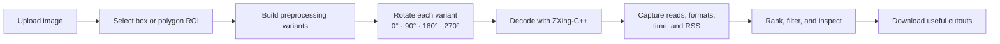

# How QRMetrics works

This guide explains what QRMetrics does after an image is loaded, what each measurement means, and how to turn a successful experiment into a useful recommendation.

## The benchmark flow



One **run** begins when a region of interest (ROI) is completed. Results remain in the run stack until reset, so different regions of the same source image can be compared without uploading it again.

## 1. Image input and region selection

Images can be uploaded from disk or fetched from a public HTTP(S) image URL. URL downloads reject private or local network addresses and responses larger than 15 MB.

QRMetrics supports two ROI shapes:

- **Box:** two corners define a rectangular crop.
- **Polygon:** four selected corners are ordered and perspective-warped into a rectangular crop. This is useful when a label is tilted relative to the camera.

Selection coordinates remain tied to the original image while the canvas is zoomed. Zoom changes the view, not the pixels sent to the benchmark.

## 2. Preprocessing matrix

The current engine creates 30 image variants. Every variant is tested at four explicit orientations, producing 120 decode attempts per ROI with the current defaults.

| Group | Variants |
|---|---|
| Baselines | Original ROI with all-format search; original ROI with the selected format; original ROI with ZXing rotation search |
| Geometry and scale | Tight 5% crop; bicubic 2× and 3× upscale; perspective rectification |
| Tone and contrast | 2nd–98th percentile contrast stretch; gamma 1.5; CLAHE; polarity inversion |
| Detail recovery | Unsharp mask; denoise then sharpen; Wiener deblur; black-hat morphology |
| Thresholding | Adaptive Gaussian; Otsu; Sauvola; Niblack; fixed thresholds at 80, 120, 160, and 200 |
| Morphology | 3×3 closing; 2×2/3×3 erosion; 2×2/3×3 dilation |
| Symbol boundary | 30 px white quiet-zone padding |
| Combined recipe | Crop → rectify → 2× upscale → denoise → contrast stretch → gamma → CLAHE → deblur → sharpen → adaptive threshold → close → quiet zone |

These are experiments, not a sequence applied to every image. Most rows apply one focused recipe to the original ROI. Only **All preprocessing** chains the listed operations.

## 3. ZXing-C++ configuration

The web interface currently uses the `zxing-cpp` Python binding.

- **Barcode format:** Data Matrix by default. Auto detect searches every supported format; a specific format narrows the search.
- **Pure barcode:** off by default. Turn it on only when the input is a clean, tightly cropped, aligned symbol without surrounding scene content.
- **Try harder:** on by default. In this application it controls ZXing's inverted-polarity and downscale searches. The binding's native `TryHarder` behavior is enabled internally.
- **Rotation:** every image variant is explicitly tested at four orientations. The separate auto-rotation baseline also enables ZXing's own rotation search.

The all-format raw baseline provides a broad reference even when a specific format is selected for the rest of the matrix.

## 4. What is measured

QRMetrics uses wall-clock measurements around each operation.

| Metric | Meaning |
|---|---|
| Preprocessing time | Time to create that image variant from the ROI |
| Rotation time | Time to create the tested orientation |
| Decode time | Time spent in the ZXing-C++ read call |
| Configuration time | Rotation time plus decode time |
| Total time | Preprocessing, rotation, and decode time combined |
| Output size | Memory occupied by the generated image array |
| RSS delta | Change in process resident memory before and after an operation |

Preprocessing time is measured once per variant but displayed for each orientation using it. It should not be interpreted as four separate preprocessing executions.

RSS is an approximate process-level observation, not isolated or peak memory for one algorithm. Allocators, garbage collection, and buffers reused by Python, NumPy, OpenCV, or ZXing can produce zero, negative, or noisy deltas.

## 5. How results are ranked

The default **Most complete** order answers: *which configuration recovered the most barcode data, and which of those equally complete configurations was cheapest?*

```text
barcode count: descending
total time:     ascending when counts tie
```

This prevents a quick partial result from outranking a slightly slower result that found more symbols. It does not prove that decoded values are correct. When ground truth matters, compare the returned values with known expected values and inspect the generated cutouts.

The **Fastest** order sorts successful attempts only by total time. Filters can narrow results by minimum barcode count, success or failure, detected format, and preprocessing-step terms.

## 6. Reading a result card

A card keeps the decision-making details visible at a glance:

- success or failure;
- number and formats of decoded barcodes;
- total and decode time;
- preprocessing recipe and input orientation.

Expanding the card reveals decoded text and raw bytes, the complete reader configuration, detailed timing and RSS values, and the exact cutout tested. Successful cards appear in green; failed attempts appear in red and remain useful for identifying recipes that should be avoided for that image.

## 7. Saving and comparing runs

- Press `S` to download successful cutouts from the latest ROI run.
- Press `D` to download every generated cutout from all current runs.
- Press `R` to clear the run stack and server-side artifacts.

For a fair comparison, keep the source image, ROI, machine load, dependency versions, and reader settings constant. Repeat important measurements outside the UI before using small timing differences to make production decisions.

## Current scope and limitations

QRMetrics v1 is a local ZXing-C++ exploration tool. It currently does not provide:

- labelled ground truth or accuracy metrics such as precision and recall;
- repeated trials, warm-up control, or latency percentiles;
- isolated CPU utilization or peak-memory sampling;
- GPU execution;
- verified Windows or macOS support;
- side-by-side decoder-library comparisons.

Those boundaries are intentional: the current version helps discover promising configurations and preserve the evidence behind them. A production benchmark should add controlled datasets, repeat trials, environment metadata, and correctness checks.

## Code map

| Path | Responsibility |
|---|---|
| `app.py` | Flask endpoints, ROI orchestration, timing, run storage, and downloads |
| `barcode_bbox_tester.py` | Image operations, ZXing adapter, and the optional OpenCV desktop interface |
| `templates/index.html` | Browser application structure |
| `static/app.js` | Drawing, zoom, run state, filters, sorting, and result rendering |
| `static/style.css` | Interface styling |
| `start.sh` | Local environment setup and launch |

Generated uploads and artifacts live under `.web_data` and are excluded from Git.
